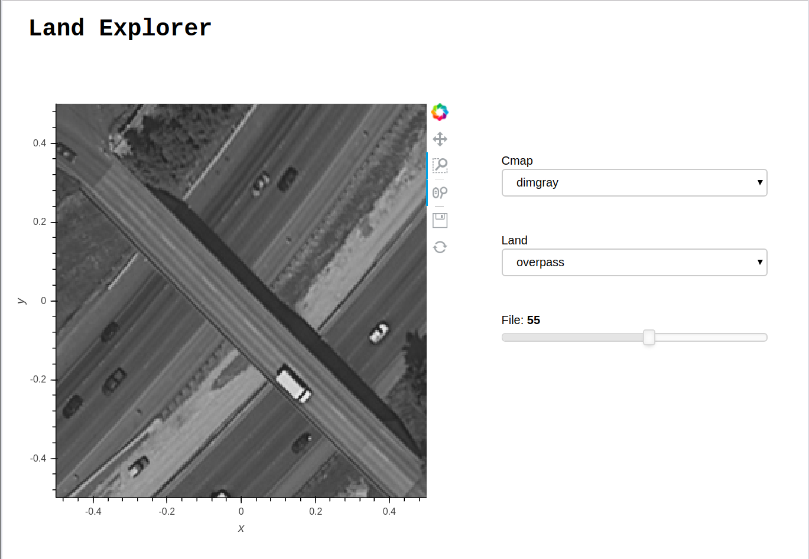

# Land Explorer

This dashboard has been created to visualise the land use data available [here](https://s3.amazonaws.com/earth-data/UCMerced_LandUse/catalog.yml).

This notebook shows three different methods of generating same dashboard:
> 1. Using Holoviews Dynamic Map
> 2. Using Panel, Streams and Params
> 3. Using [Param](https://panel.pyviz.org/user_guide/Param.html)



## Installation

1. git clone https://github.com/hdsingh/Land-Explorer

2. cd Land-Explorer

3. `conda env create -f environment.yml`  or 
    ```
    conda create env -n land_env
    conda activate land_env
    conda install -c conda-forge -c defaults cartopy xarray zarr netcdf4 tqdm
    conda install -c conda-forge intake intake-xarray gcsfs s3fs
    conda install -c pyviz/label/dev -c bokeh/label/dev bokeh datashader holoviews geoviews hvplot param panel
    ```

## Deployment

Deploy this dashboard from the CLI using:

 $ panel serve LandExplorer.ipynb